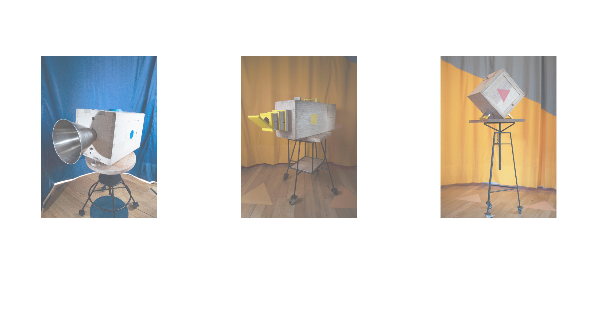

# Three geometries for dialogue

These are three pedagogical tools that work as a support for psychosocial processes and exercises, as well as mediators in the participatory construction of a restorative justice space. These devices want to be translators of the life testimonies, feelings and circumstances that made the conflict or felony happen and transform them into communication exercises that bring facts closer and make them tangible, that foster dialogue and a mutual understanding of agreements and reparation.

Developed by [h-orizontal](http://h-orizontal.org/) alongside a group of collaborators, these devices are organized around three different communication systems: trace, sound and projection. Witch each box, [a series of workshops and a space intervention](http://h-orizontal.org/en/estrategia/restorative-justice-program-in-bogota/) were developed for the adolescents and professionals from the restorative justice program for adolescents in Bogotá, Colombia.

horizontal open sourced the design so that in the future they could be made by the adolescents themselves, other restorative justice initiatives or anyone interested in participative and interactive design processes.

To find out more, visit the [project website](http://h-orizontal.org/en/estrategia/pedagogic-tools-for-restorative-justice/).
